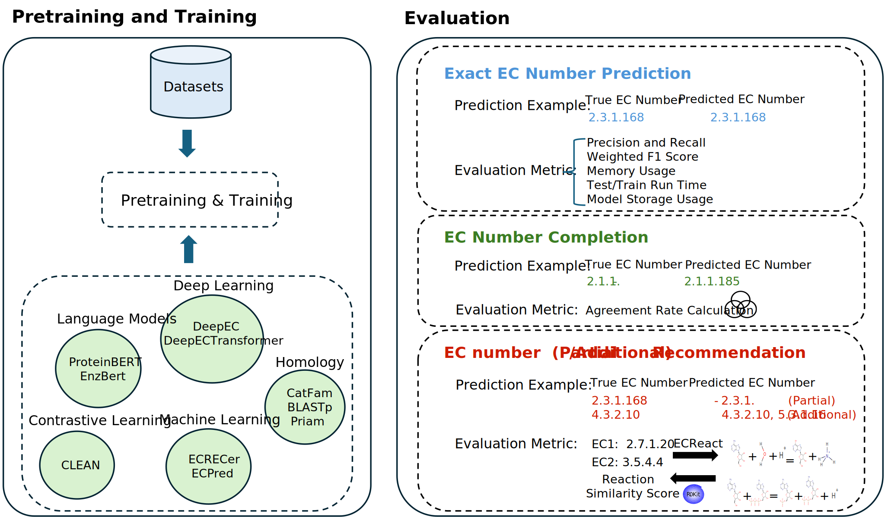

# EC-Bench: A Benchmark for Enzyme Commission Number Prediction

**EC-Bench** is a benchmark framework for evaluating enzyme annotation models that predict Enzyme Commission (EC) numbers from protein sequences. EC numbers describe the biochemical reactions enzymes catalyze, and predicting them accurately is essential for understanding protein function.

While many EC prediction methods already exist — including homology-based tools, deep learning models, contrastive learning techniques, and protein language models — there's been no consistent way to evaluate and compare their performance. **EC-Bench** fills this gap by offering a unified, open-source platform.




---

## 🧬 What are EC Numbers?

Enzyme Commission (EC) numbers are four-level hierarchical annotations that classify enzymes based on the chemical reactions they catalyze. Accurate EC prediction is essential for understanding enzyme functions, annotating protein sequences, and advancing functional genomics.

---


## 🚀 Features

- **Standardized Datasets:** Pretraining, training, and testing datasets prepared from UniProtKB (Swiss-Prot and TrEMBL) and Price-149.
- **Model Coverage:** 10 representative models, spanning homology-based (e.g., BLASTp), deep learning, contrastive learning (e.g., CLEAN), and protein language models (e.g., EnzBert, ProteinBERT).
- **Multiple Evaluation Tasks:**
  - *Exact EC Number Prediction*
  - *EC Number Completion*
  - *Partial/Additional EC Number Recommendation*
- **Evaluation Metrics:**
  - Performance: Weighted F1, Precision, Recall
  - Resource Usage: Memory, Runtime, Storage
  - Consistency: Agreement Rate, Reaction Similarity
- **Interoperable Framework:** Easily add and evaluate new models.

---


## 🧪 Benchmark Tasks

### 1. Exact EC Number Prediction
Predict the full EC number at all levels (1-4). Performance is measured using:

- *Precision* = TP / (TP + FP)
- *Recall* = TP / (TP + FN)
- *F1 Score (Weighted)* = Takes class imbalance into account

### 2. EC Number Completion
Fill in missing parts of partial EC numbers. Since ground truth may be unavailable, we measure:

- **Coverage**: Fraction of proteins for which a complete EC number was generated.
- **Agreement Rate**: Percentage of completions where a majority of models agree.

### 3. Partial/Complete EC Number Recommendation
Suggest novel or alternate EC numbers. Evaluated via:

- **Reaction Similarity Score**: Computed using RDKit and reactions from ECReact.
- **Weighted/Average Similarity Score**: Combines similarity with prediction coverage.

---

## 📊 Evaluation Metrics

| Metric              | Description |
|---------------------|-------------|
| **Precision**       | Accuracy of positive predictions |
| **Recall**          | Coverage of relevant EC classes |
| **F1 Score**        | Harmonic mean of precision and recall |
| **Agreement Rate**  | Model consensus on EC completions |
| **Reaction Similarity** | Biochemical similarity of predicted vs. true EC reactions |
| **Memory Usage (GiB)** | GPU/CPU memory during training |
| **Model Size (MiB)** | Disk storage footprint |
| **Runtime (s)**     | Time for inference and training |

---

## 📂 Datasets

| Dataset Type | Source | Version |
|--------------|--------|---------|
| Pretraining  | TrEMBL | 2018-02 |
| Training     | Swiss-Prot | 2018-02 |
| Test         | Swiss-Prot | 2023-01 |
| Challenging Test | Price-149 | Manual |

---

## Models

|       Model Name        | Link                                                        | Year |
|-------------------|------------------------------------------------------------|------|
|       ProteinBERT       | [LINK](https://github.com/nadavbra/protein_bert)         |  2022    |
|       DeepEC            | [LINK](https://bitbucket.org/kaistsystemsbiology/deepec/src/master/) |   2018   |
|       ECPred            | [LINK](https://github.com/cansyl/ECPred)                 |  2018    |
|       DeepECtransformer | [LINK](https://github.com/kaistsystemsbiology/DeepProZyme) |   2023   |
|       EnzBERT           | [LINK](https://gitlab.inria.fr/nbuton/tfpc)              |   2023   |
|       ECRECer           | [LINK](https://github.com/kingstdio/ECRECer)             |  2022    |
|       CLEAN             | [LINK](https://github.com/tttianhao/CLEAN)               |  2023    |
|       BLASTp            | [LINK](https://github.com/bbuchfink/diamond/wiki)        |  2008    |
|       CatFam            | [LINK](http://www.bhsai.org/downloads/catfam.tar.gz)     |  2008    |
|       PRIAM           | [LINK](http://priam.prabi.fr/REL_JAN18/Distribution.zip)   |  2013    |


---

## Table of Contents

- [Installation](#installation)
- [Data Preparation](#data-preparation)
- [Models](#models)
- [Usage](#usage)
- [Contributing](#contributing)
- [Citation](#citation)
- [License](#license)

## Installation
1. Install [conda](https://docs.conda.io/projects/conda/en/latest/user-guide/install/)
2. Clone the repository  
```
git clone https://github.com/dsaeedeh/EC-Bench.git
```
3. Install each model by following the instructions in their respective README files.

### Data Preparation
1. Run download_data.sh to download the data: 
```
sbatch download_data.sh
```
or 
```
./download_data.sh
```
2. Run extract_coordinates.sh to extract the coordinates from the downloaded data:
```
sbatch extract_coordinates.sh
```
3. Run data_preprocessing.sh; Removes duplicates and invalid sequences and non-enzyme sequences from the data
```
sbatch data_preprocessing.sh
```
4. Run run_mmseqs2.sh to concat fasta files (pretrain.fasta, train.fasta, test.fasta, price.fasta, and ensemble.fasta (if existed)). Be sure no other .fasta files are existed in the data directory.
We need "all.fasta" file to run mmseqs2 on it!
```
sbatch run_mmseqs2.sh
```
5. Run create_data.sh to create the final data for training, testing, and ensemble; Output files are: train_ec.csv, test_ec.csv, ensemble_ec.csv for each similarity threshold.
```
sbatch create_data.sh
```
6. Run go_creator.sh to create the GO terms for pretraining data; Output files are: pretrain_go_final.csv
```
sbatch go_creator.sh
```


## Contributing
We welcome contributions from the community! You can:

- 🧩 Add new models to the benchmark.
- 📊 Suggest or implement new evaluation metrics.
- 🛠 Improve preprocessing pipelines or dataset support.
- 📝 Report issues or suggest enhancements.

To contribute:
1. Fork the repository.
2. Open a pull request with your proposed changes.
3. If you are adding a model, include clear instructions and dependencies.

Feel free to open an issue for discussion before submitting major changes.

## Citation

If you use EC-Bench in your research, please cite the following:

```bibtex
@article{EC-Bench,
  title={EC-Bench: A Benchmark for Enzyme Commission Number Prediction},
  author={Saeedeh Davoudi et al.},
  journal={Bioinformatics},
  year={2025}
}
```

## Contact
For questions or feedback, please contact:

```
Saeedeh Davoudi
saeedeh.davoudi@ucdenver.edu
```

## License
EC-Bench is distributed under the [MIT License](https://github.com/dsaeedeh/EC-Bench/blob/main/LICENSE).


